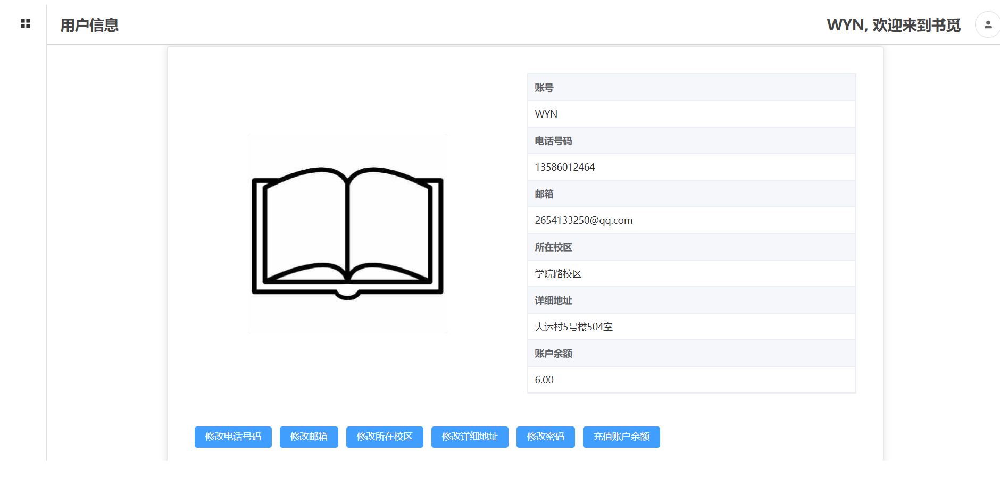
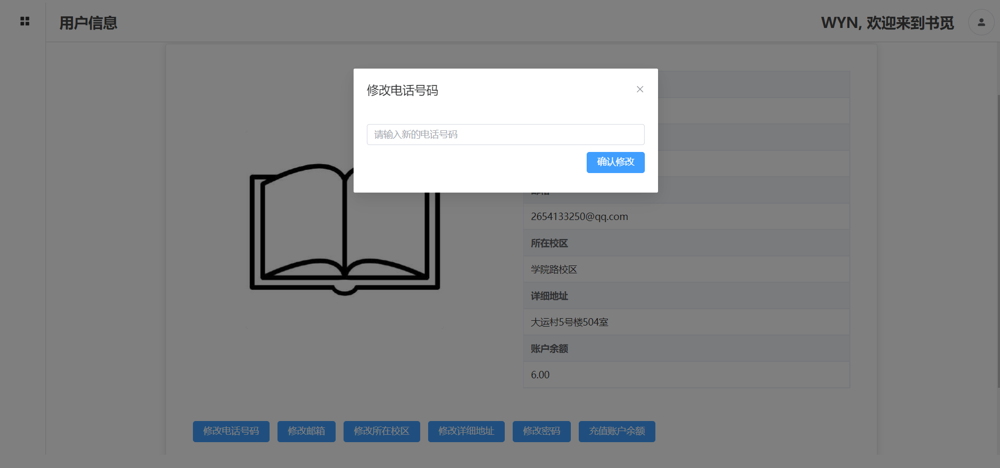

# 1 系统结构设计（包括体系结构和功能结构）
## 1.1 体系结构
本次数据库实验，我们采用了Vue3与Django框架的前后端分离的Web开发。
### 1.1.1 前端
前端我们选择了vue3框架。
Vue 3 是一个用于构建现代 Web 应用的渐进式框架，它是 Vue 2 的升级版本，带来了许多新的特性和优化。其中最重要的特性之一是组合式 API，它是一种新的编写组件逻辑的方式，可以让我们更灵活地组织和重用代码，以及更好地管理复杂的状态。另一个重要的特性是响应式系统，Vue 3 使用了基于 Proxy 的响应式系统，可以提高性能和内存效率，以及支持更多的数据类型，例如 Map 和 Set。Vue 3 还改进了模板编译器，可以生成更高效的代码，以及支持更多的语法特性，例如动态指令参数和片段。此外，Vue 3 还提供了自定义渲染器 API，让我们可以自定义渲染过程，以及使用 Vue 3 来构建跨平台的应用，例如原生应用和小程序。总而言之，Vue 3 是一个强大而灵活的框架，可以让我们轻松地开发出高质量的 Web 应用。
另外，我们额外引入了Axios、Element-Plus和MockJs等插件包来方便我们的前端开发。
#### 1.1.1.1 Axios
Axios 是一个基于 Promise 的 HTTP 库，可以用于在 Vue 3 项目中发送和接收数据。Axios 可以让我们轻松地配置请求的参数，拦截请求和响应，取消请求，转换数据格式，处理错误等。Axios 还支持浏览器和 Node.js 环境，以及 TypeScript 类型定义，使得它更加通用和可靠。
#### 1.1.1.2 Element-Plus
Element Plus 是一个基于 Vue 3 的组件库，它提供了一系列的高质量的 UI 组件，可以让我们在 Vue 3 项目中快速地构建出美观和实用的界面。Element Plus 可以让我们轻松地定制组件的样式，主题，尺寸等，以适应不同需求。Element Plus 是一个优秀而灵活的组件库，能够提高我们在 Vue 3 项目中的开发体验。
#### 1.1.1.3 Mockjs
Mockjs 是一个用于生成模拟数据的 JavaScript 库，可以用于在 Vue 3 项目中模拟后端的接口和数据。Mockjs 可以让我们使用简单的模板语法，来定义数据的结构和规则，例如类型，长度，范围，格式等。Mockjs 还可以让我们拦截 Ajax 请求，返回自定义的数据，从而实现前后端分离的开发模式。
### 1.1.2 前端实现环境
```l
├── @babel/core@7.22.15
├── @babel/eslint-parser@7.22.15
├── @vue/cli-plugin-babel@5.0.8
├── @vue/cli-plugin-eslint@5.0.8
├── @vue/cli-plugin-pwa@5.0.8
├── @vue/cli-plugin-router@5.0.8
├── @vue/cli-plugin-vuex@5.0.8
├── @vue/cli-service@5.0.8
├── axios@1.5.0
├── core-js@3.32.2
├── element-plus@2.3.12
├── eslint-plugin-vue@8.7.1
├── eslint@7.32.0
├── mockjs@1.1.0
├── register-service-worker@1.7.2
├── sass-loader@12.6.0
├── sass@1.66.1
├── v-tooltip@2.1.3
├── vue-router@4.2.4
├── vue@3.3.4
└── vuex@4.1.0
```
### 1.1.2 后端
后端我们选择了Django框架进行开发。
Django 是一个使用 Python 语言编写的开源 Web 框架，它可以让我们快速地开发出安全和可维护的网站。Django 的优点在于它遵循了“功能完备”的理念，提供了许多常用的 Web 开发功能，让我们无需重新造轮子。同时，它也是一个通用的框架，可以用来构建各种类型和规模的网站。Django 还注重安全性，可以帮助我们防范常见的 Web 攻击，通过提供一些安全的默认设置和实践。此外，Django 还具有可扩展性和可维护性，可以通过添加硬件或使用不同的组件来适应不同的负载和需求，它也有一个活跃的社区和丰富的第三方库，可以让我们找到合适的解决方案。Django 是一个强大而灵活的 Web 框架，可以让我们用 Python 语言来实现你的 Web 系统。

#### 1.1.2.1 后端实现环境
```
asgiref==3.7.2
backports.zoneinfo==0.2.1 
Django==4.2.5             
django-cors-headers==4.2.0
PyMySQL==1.1.0
sqlparse==0.4.4
typing_extensions==4.7.1
tzdata==2023.3

```
### 1.1.3 前后端交互
我们通过Axios向后端的Django框架发送对象类型的数据，后端则以Json形式返回数据。具体来说，前端可以根据用户的请求，用 axios 发送 GET 请求或Post请求给后端，以获取数据。后端收到前端的请求后，通过Django的数据库操作语言从数据库中查询数据，把查询结果编码成 json 格式，返回给前端显示，也可以对数据库进行增删改查的操作。 
## 1.2 功能结构
本次数据库实验实现的书籍传递平台分为买书端、售书端，每个用户既可以是买家，也可以是卖家。
### 1.2.1 买书端

- 用户注册和登录：
买家可以注册账号，设置密码、个人信息，充值账户余额等，登录后可以查看和管理自己的账户。
- 在售书籍查看和搜索：
买家可以根据自己想要购买的书籍名称对所有的在售书籍进行搜索，根据书籍封面和介绍等信息挑选自己心仪的书籍。
- 书籍详情和评论：
买家可以查看每本书籍的详细信息，包括书籍的介绍（出版社、新旧程度等）、卖家所在的校区、详细地址，以及其他用户对该卖家的评论和评价。买家也可以对自己购买过的卖家进行评论和评价，给出评论和反馈。
- 书籍交易和支付：
买家可以通过在线或线下的方式与卖家进行沟通和交易，如私信、电话、微信等。如果选择在线支付，买家可以通过平台进行支付。如果选择线下交易，买家可以自行联系卖家，并约定交易地点和时间。
- 书籍购物车：
买家可以将自己感兴趣的书籍加入购物车，方便以后查看、购买和一次性结算所有购买的书籍。
- 查看书籍订单信息：
购买书籍后，买家可以在“已购买的书籍”栏目中查看自己已购买的书籍，查看订单的详细信息，如卖家的校区、详细地址等，方便与卖家的沟通和交流。
- 消息发送和接收：
买家可以与卖家进行交易信息的交流，确定交易方式和书籍的交货地点等，也可以交换微信号来进行更高级别的交流，使得交易更加顺利。
- 查看历史购买记录：
买家可以查看历史购买记录，方便在交易后有问题时联系卖家，协商解决。
- 发布求书贴：
买家在浏览和搜索在售书籍后，如果没有找到自己想要的书籍，可以发布求书贴，描述自己想要书籍的详细信息和自己的联系方式，方便拥有该二手书的卖家同学看到需求，发布在售书籍。如果此后已经获得该书籍或有该书籍上架，则可以撤回求书贴。

### 1.2.2售书端

- 用户注册和登录：
卖家可以注册账号，设置密码、个人信息，充值账户余额等，登录后可以查看和管理自己的账户。
- 在售书籍发布：
卖家可以发布自己想要出售或捐赠的二手书籍，填写书籍的名称、作者、出版社、价格、图片、描述等信息，以及联系方式和交易方式。发布后的在售书籍可以被买家浏览和搜索。
- 查看已发布的书籍售出信息：
卖家可以查看已发布的书籍的售出信息，如果信息有误或者想要添加更多信息，卖家可以撤回在售书籍后重新发布在售书籍。
- 查看已售出的书籍订单信息：
卖家在自己发布的书籍有人购买后，可以查看已售出的书籍订单信息，获得买家的详细信息和联系方式，方便后续的交易沟通。
- 消息发送和接收：
卖家可以与买家进行交易信息的交流，包括线下书籍的交易地点和时间、支付的方式等。也可以交换微信号等从而获得更加高级的交流途径。系统在卖家的书籍有人购买后和确认收货后，均会自动发送消息到卖家，从而起到提醒作用。
- 书籍交易和支付：
卖家可以通过在线或线下的方式与买家进行沟通和交易，如私信、电话、微信等。
- 查看求书贴：
卖家可以在帖子广场查看买家发布的求书贴，从而获悉书籍的需求，在自己有闲置的书籍时直接与买家联系或者上架书籍。

# 2 数据库基本表的定义
本次数据库实验要求我们将数据库系统中的所有基本表都规范到3NF范式。经过概念模式的规范化，我们去除了所有可能产生数据冗余的实体和属性定义，这为我们后端的数据库操作带来了极大的简化。经过概念模式到逻辑模式的转换，最终形成了7个基本表，分别为用户信息表(user_info)、求书贴表(post)、卖家评论表(comment)、消息表(message)、书籍订单表(order)、购物车书籍表(cart)、在售书籍表(sell_book)。具体如下。
### 2.1 用户信息表
| 名称 | 数据类型 | 大小 |是否必填 |是否主键 |功能|
| ------- | ------- | ------- |-------|-------|-------|
| user_id | Int | \\ |是|是|用户id（唯一标识）|
| user_password | Varchar | 64 |是|否|用户登录密码|
|user_name|Varchar|64|是|否|用户昵称|
|user_phone_num|Varchar|11|否|否|用户联系电话|
|user_email|Varchar|64|否|否|用户联系邮箱|
|user_campus|Varchar|32|否|否|用户所在校区|
|user_address|Varchar|64|否|否|用户详细地址|
|user_money|DECIMAL|两位小数|是|否|用户余额|
#### Django Model
```
class user_info(models.Model):
    user_id = models.IntegerField(primary_key=True)
    user_password = models.CharField(max_length=64)
    user_name = models.CharField(max_length=64)
    user_phonenum = models.CharField(max_length=11)
    user_email = models.CharField(max_length=64)
    user_campus = models.CharField(max_length=32)
    user_address = models.CharField(max_length=64)
    user_money = models.DecimalField(max_digits=32, decimal_places=2, default=0.00)

    class Meta:
        db_table = 'user_info'  # 移除前缀
```
### 2.2 求书贴表
| 名称 | 数据类型 | 大小 |是否必填 |是否主键 |功能|
| ------- | ------- | ------- |-------|-------|-------|
| post_id | Int | \\ |是|是|帖子id（唯一标识）|
| user_id | Int      | \\ |是|用户信息表外键|用户登录id（唯一标识）|
| content | Varchar | 256 |是|否|帖子内容|
| post_date | Date | \\ |是|否|发布时间|
#### Django Model
```
class post(models.Model):
    post_id = models.IntegerField(primary_key=True)
    user = models.ForeignKey(user_info, on_delete=models.CASCADE)
    title = models.CharField(max_length=256)
    content = models.CharField(max_length=256)
    post_date = models.DateField(auto_now=True, auto_now_add=False)

    class Meta:
        db_table = 'post'
```
### 2.3 卖家评论表
| 名称 | 数据类型 | 大小 |是否必填 |是否主键 |功能|
| ------- | ------- | ------- |-------|-------|-------|
|comment_id|Int|\\|是|是|标识评论的id|
|commented_user_id|Int|\\|是|用户信息表外键|被评论卖家的id|
|comment_user_id|Int|\\|是|用户信息表外键|评论的买家id|
|comment_date|Date|\\|是|否|评论时间|
|comment_content|Varchar|256|是|否|评论内容|
#### Django Model
```
class comment(models.Model):
    comment_id = models.IntegerField(primary_key=True)
    commented_user = models.ForeignKey(user_info, related_name="+", on_delete=models.CASCADE)
    comment_user = models.ForeignKey(user_info, related_name="+", on_delete=models.CASCADE)
    comment_date = models.DateField(auto_now=True)
    comment_content = models.CharField(max_length=256)

    class Meta:
        db_table = 'comment'
```
### 2.4 消息表
| 名称 | 数据类型 | 大小 |是否必填 |是否主键 |功能|
| ------- | ------- | ------- |-------|-------|-------|
|message_id|Int|\\|是|是|唯一标识消息的id|
|from_solder|Int|\\|是|否|为1表示消息来自卖家，为0表示消息来自买家|
|send_id|Int|\\|是|用户信息表外键|发送者id|
|receive_id|Int|\\|是|用户信息表外键|接收者id|
|message_time|Date|\\|是|否|发送时间|
|message_content|Varchar|256|是|否|消息内容|
#### Django Model
```
class message(models.Model):
    message_id = models.IntegerField(primary_key=True)
    from_solder = models.IntegerField()
    send = models.ForeignKey(user_info, related_name='+', on_delete=models.CASCADE)
    receive = models.ForeignKey(user_info, related_name='+', on_delete=models.CASCADE)
    message_time = models.DateField(auto_now=True)
    message_content = models.CharField(max_length=256)

    class Meta:
        db_table = 'message'
```
### 2.5 书籍订单表
| 名称 | 数据类型 | 大小 |是否必填 |是否主键 |功能|
| ------- | ------- | ------- |-------|-------|-------|
|order_id|Int|\\|是|是|唯一标识订单的id|
|order_time|Date|\\|是|否|购买时间|
|order_book_intro|Varchar|256|是|否|书籍介绍|
|order_book_name|Varchar|256|是|否|书籍名称|
|order_book_price|Decimal|2位小数|是|否|书籍价格|
|order_book_photo|MediumBlob|16MB|是|否|书籍封面图片|
|order_customer_id|Int|\\|是|用户信息表外键|买家id|
|order_merchant_id|Int|\\|是|用户信息表外键|卖家id|
|order_status|Varchar|10|是|否|订单状态|
#### Django Model
```
class order(models.Model):
    order_id = models.IntegerField(primary_key=True)
    order_time = models.DateField(auto_now=True)
    order_book_intro = models.CharField(max_length=256)
    order_book_name = models.CharField(max_length=256)
    order_book_price = models.DecimalField(max_digits=10, decimal_places=2)
    order_book_photo = models.BinaryField()
    order_customer = models.ForeignKey(user_info, related_name="+", on_delete=models.CASCADE)
    order_merchant = models.ForeignKey(user_info, related_name="+", on_delete=models.CASCADE)
    order_status = models.CharField(max_length=10)

    class Meta:
        db_table = 'order'
```
### 2.6 购物车书籍表
| 名称 | 数据类型 | 大小 |是否必填 |是否主键 |功能|
| ------- | ------- | ------- |-------|-------|-------|
|cart_id|Int|\\|是|是|唯一标识购物车项目的id|
|cart_item_id|Int|\\|是|在售书籍表外键|唯一标识在售书籍的id|
|cart_custom_id|Int|\\|是|用户信息表外键|购物车所属买家的id|
#### Django Model
```
class cart(models.Model):
    cart_id = models.IntegerField(primary_key=True)
    cart_item = models.ForeignKey(sell_book, on_delete=models.CASCADE)
    cart_custom = models.ForeignKey(user_info, on_delete=models.CASCADE)

    class Meta:
        db_table = 'cart'
```
### 2.7 在售书籍表
| 名称 | 数据类型 | 大小 |是否必填 |是否主键 |功能|
| ------- | ------- | ------- |-------|-------|-------|
|sell_id|Int|\\|是|是|唯一标识在售书籍的id|
|sell_merchant_id|Int|\\|是|用户信息表的外键|卖家id|
|sell_book_intro|Varchar|256|是|否|书籍介绍|
|sell_book_name|Varchar|256|是|否|书籍名称|
|sell_book_price|Decimal|2位小数|是|否|书籍价格|
|sell_book_photo|MediumBlob|16MB|是|否|书籍封面图片|
#### Django Model
```
class sell_book(models.Model):
    sell_id = models.IntegerField(primary_key=True)
    sell_merchant = models.ForeignKey(user_info, on_delete=models.CASCADE)
    sell_book_intro = models.CharField(max_length=256)
    sell_book_name = models.CharField(max_length=256)
    sell_book_price = models.DecimalField(max_digits=10, decimal_places=2)
    sell_book_photo = models.BinaryField()

    class Meta:
        db_table = 'sell_book'
```

# 3. 系统重要功能实现方法
## 3.1 触发器
MySQL 的触发器是一种与表相关的数据库对象，它可以在表的数据发生变化时自动执行一些预定义的 SQL 语句。触发器的作用有以下几点：
- 触发器可以保证数据的完整性和一致性，例如在插入或更新数据前，检查数据是否符合业务逻辑，如果不符合，可以拒绝操作或者返回错误信息。
- 触发器可以实现数据的自动更新和同步，例如在表 A 插入或删除一条数据后，自动在表 B 中插入或删除相应的数据，或者更新表 B 中的统计信息。
- 触发器可以实现数据的日志记录和审计，例如在表的数据发生变化后，自动在另一个表中记录操作的时间、用户、内容等信息，方便后续的分析和追踪。
为了保证数据的完整性和一致性，我们在后端数据库中引入了触发器。如在用户购买书籍（从在售书籍表移除该书籍）前，触发删除购物车书籍表中的所有对应书籍的表项。
## 3.2 索引
MySql的索引是一种用于提高数据检索速度的数据结构，它可以根据一列或多列的值对表中的数据进行排序。MySql支持多种类型的索引，如主键索引、唯一索引、全文索引等，它们有不同的功能和使用场景。
数据库管理系统会选择合适的存储管理方式和算法如索引等进行物理结构优化。从使用者的角度看，虽然我们无法对MySQL数据库中封装好的物理结构进行优化，但我们可以设计优化逻辑结构去适应物理结构，提高数据库性能。
我们为数据库中的每一行数据添加了索引标识，基于索引的物理结构。其中，最常用的索引标识是主键索引 Primary Key。我们在创建表和插入数据时，同时建立了主键索引。这样，我们就可以利用 MySQL 数据库管理系统的物理结构，维护数据索引，优化查询过程。
## 3.3 存储过程
存储过程主要用Django封装好的数据库操作语句实现，前端发送请求后，后端响应请求，处理和返回相应数据。
### 3.3.1 用户登录
- 前端Vue文件：Login.vue
- 涉及的基本数据表：user_info
- 请求路径：/api/login
- 流程解析：
  前端发送post请求，其中
    ```  
    username:String类型，表示账号
    password:String类型，表示密码 
    ```
  后端接收请求，搜索用户信息表，查找对应于username和password的行。
  向前端返回信息：
    ```
    isSuccess:Boolean类型,True表示登录成功，False表示登录失败
    userId:int类型，标识用户的唯一id
    ```
  前端接收信息，若isSuccess为True则登录成功，跳转到主页面，并在本地存储userId。否则显示错误信息。

- 代码实现：
```python
def login(request):
    assert request.method == "POST"
    request_dict = json.loads(request.body.decode('utf-8'))

    name = request_dict['username']
    password = request_dict['password']

    query_result = user_info.objects.filter(user_name=name, user_password=password).values('user_id')
    if len(query_result) == 1:
        response = {'isSuccess': True,
                    'userid': query_result[0]['user_id']}
    else:
        response = {'isSuccess': False}
    return JsonResponse(response)
```
### 3.3.2 用户注册
- 前端Vue文件：Register.vue
- 涉及的基本数据表：user_info
- 请求路径：/api/register
- 流程解析：
  前端发送post请求，其中
    ```  
    username:String,用户名
    password:String，用户登录密码
    email: String，用户邮箱
    phoneNum: String，10位只含数字的字符串
    campus: String，用户所在校区
    address: String，用户所在具体地址
    ```
  后端接收请求，搜索用户信息表，先检查邮箱是否注册过，若已注册过，则返回"邮箱已被注册"，若没注册过，再检查用户昵称是否已存在，若已存在，则返回“用户昵称已存在”。若注册成功，则为新注册用户分配唯一的userid，向用户信息表中添加相应表项，并返回成功信息。
  
  向前端返回信息：
  
    ```
    message:String，错误信息
    success:Boolean, 注册是否成功
    ```
  前端接收信息，若success为True，则返回注册成功信息，并跳转到登录界面；否则显示message错误信息。
  
- 代码实现：
```python
def register(request):
    assert request.method == "POST"
    request_dict = json.loads(request.body.decode('utf-8'))

    name = request_dict['username']
    email = request_dict['email']
    password = request_dict['password']
    phone = request_dict['phoneNum']
    campus = request_dict['campus']
    address = request_dict['address']
    response = {
        'success': False,
        'message': '',
        'user_id': '',
        'user_name': ''
    }

    exit_email = user_info.objects.filter(user_email=email)  # 查询邮箱是否存在
    if len(exit_email) >= 1:
        response['message'] = "邮箱账户已存在"
        return JsonResponse(response)

    exit_name = user_info.objects.filter(user_name=name)  # 查询用户昵称是否存在
    if len(exit_name) >= 1:
        response['message'] = "用户昵称已存在"
        return JsonResponse(response)

    max_id = user_info.objects.all().aggregate(Max('user_id'))  # 查询当前最大的id
    if max_id['user_id__max'] is not None:
        new_id = int(max_id['user_id__max']) + 1  # 若不为空，新id为最大id加1
    else:
        new_id = 1  # 若为空，id为1
    response['success'] = True
    response['user_id'] = new_id
    response['user_name'] = name
    user_info.objects.create(user_id=new_id, user_name=name, user_email=email, user_password=password,
                             user_phonenum=phone, user_campus=campus, user_address=address)
    return JsonResponse(response)
```
### 3.3.3 发布在售书籍
- 前端Vue文件：AddSelling.vue
- 涉及的基本数据表：sell_book
- 请求路径：/api/uploadsell
- 流程解析：
  前端发送post请求，其中
    ```  
    user_id:Int,唯一标识发布者信息的id
    book_name:String,书籍名称
    book_intro:String,书籍介绍
    book_price:Decimal,书籍价格
    book_image:String，书籍图片的base64编码
    ```
  后端接收请求，为新上传的在售书籍分配一个唯一标识书籍的id，并将书籍的信息加入到在售书籍表中。
  向前端返回信息：
  
    ```
    success:Boolean，是否加入成功
    message:String类型，若不成功的错误信息
    ```
  前端接收信息，若加入成功，显示成功信息，否则显示错误信息。
  
- 代码实现：
```python
def uploadsell(request):
    assert request.method == "POST"
    request_dict = json.loads(request.body.decode('utf-8'))

    merchant_id = request_dict['user_id']
    book_name = request_dict['book_name']
    book_intro = request_dict['book_intro']
    book_price = request_dict['book_price']
    book_image = request_dict.get('book_image')
    image_data = base64.b64decode(book_image)
    response = {
        'success': False,
        'message': '',
    }

    if len(book_name) > 256:
        response['message'] = "书籍名称过长，最多为256字"
        return JsonResponse(response)
    if len(book_intro) > 256:
        response['message'] = "书籍介绍过长，最多为256字"
        return JsonResponse(response)
    if book_price >= 10000000000:
        response['message'] = "书籍价格过高"
        return JsonResponse(response)
    if '.' in str(book_price) and len(str(book_price).split('.')[1]) > 2:
        response['message'] = "价格最多两位小数"
        return JsonResponse(response)

    max_id = sell_book.objects.all().aggregate(Max('sell_id'))  # 查询当前最大的id
    if max_id['sell_id__max'] is not None:
        new_id = int(max_id['sell_id__max']) + 1  # 若不为空，新id为最大id加1
    else:
        new_id = 1

    sell_book.objects.create(sell_id=new_id, sell_merchant_id=merchant_id, sell_book_intro=book_intro,
                             sell_book_name=book_name, sell_book_price=book_price, sell_book_photo=image_data)
    response['success'] = True
    return JsonResponse(response)
```
### 3.3.4 上传求书贴
- 前端Vue文件：AddPost.vue
- 涉及的基本数据表：post
- 请求路径：/api/uploadpost
- 流程解析：
  前端发送post请求，其中
    ```  
    user_id:Int,唯一标识发布者信息的id
    title:String,帖子标题
    content:String,帖子内容
    ```
  后端接收请求，为帖子分配一个唯一标识帖子的id，并将帖子的信息加入到求书贴表中。
  向前端返回信息：
  
    ```
    success:Boolean，是否加入成功
    message:String，若不成功的错误信息
    ```
  前端接收信息，若加入成功，显示成功信息，否则显示错误信息。
  
- 代码实现：
```python
def uploadpost(request):
    assert request.method == "POST"
    request_dict = json.loads(request.body.decode('utf-8'))

    user_id = request_dict['user_id']
    title = request_dict['title']
    content = request_dict['content']

    response = {
        'success': False,
        'message': '',
    }

    if len(title) > 256:
        response['message'] = "帖子标题过长，最多为256字"
        return JsonResponse(response)
    if len(content) > 256:
        response['message'] = "帖子内容过长，最多为256字"
        return JsonResponse(response)

    max_id = post.objects.all().aggregate(Max('post_id'))  # 查询当前最大的id
    if max_id['post_id__max'] is not None:
        new_id = int(max_id['post_id__max']) + 1  # 若不为空，新id为最大id加1
    else:
        new_id = 1

    post.objects.create(post_id=new_id, user_id=user_id, title=title, content=content)
    response['success'] = True
    return JsonResponse(response)
```
### 3.3.5 获取所有帖子
- 前端Vue文件：Post.vue
- 涉及的基本数据表：post
- 请求路径：/api/getallpost
- 流程解析：
  前端发送空post请求。

  后端接收请求，取出求书贴中的所有帖子，返回给前端。
  向前端返回信息：
  
    ```
    posts：一个List数组，其中元素的属性如下：
    	id:Int，唯一标识帖子的id
    	title:String，帖子的标题
    	username:String，发布帖子的用户的昵称
    	content:String，帖子的内容
    	year:Int，发布的年份
    	month:Int，发布的月份
    	day:Int，发布的日期
    ```
  前端接收信息，根据帖子的内容，将所有求书贴显示在页面上。
  
- 代码实现：
```python
def getallpost(request):
    assert request.method == "POST"
    all_post = post.objects.all().order_by('post_id').values('post_id', 'title', 'user_id', 'content', 'post_date')
    posts = []
    for i in all_post:
        i['id'] = int(i.pop('post_id'))
        user_name = user_info.objects.filter(user_id=i['user_id']).values('user_name')
        user_name = user_name[0]['user_name']
        i.pop('user_id')
        i['username'] = user_name
        i['year'] = int(str(i['post_date']).split('-')[0])
        i['month'] = int(str(i['post_date']).split('-')[1])
        i['day'] = int(str(i['post_date']).split('-')[2])
        i.pop('post_date')
        posts.append(i)
    response = {'posts': posts}
    return JsonResponse(response)
```
### 3.3.6获取某位用户发布的帖子
- 前端Vue文件：Post.vue
- 涉及的基本数据表：post
- 请求路径：/api/getuserpost
- 流程解析：
  前端发送post请求，其中
    ```  
    user_id:Int，唯一标识用户的id
    ```
  后端接收请求，取出帖子表中属于user_id对应的用户的所有帖子并返回。
  向前端返回信息：
  
    ```
    userposts：一个List数组，其中元素的属性如下：
    	id:Int，唯一标识帖子的id
    	title:String，帖子的标题
    	username:String，发布帖子的用户的昵称
    	content:String，帖子的内容
    	year:Int，发布的年份
    	month:Int，发布的月份
    	day:Int，发布的日期
    ```
  前端接收信息，将用户发布的求书贴显示在页面上。
  
- 代码实现：
```python
def getuserpost(request):
    assert request.method == "POST"
    request_dict = json.loads(request.body.decode('utf-8'))

    user_id = request_dict['user_id']

    user_post = post.objects.filter(user_id=user_id). \
        order_by('post_id').values('post_id', 'title', 'content', 'post_date')
    userposts = []
    for i in user_post:
        i['id'] = int(i.pop('post_id'))
        user_name = user_info.objects.filter(user_id=user_id).values('user_name')
        user_name = user_name[0]['user_name']
        i['username'] = user_name
        i['year'] = int(str(i['post_date']).split('-')[0])
        i['month'] = int(str(i['post_date']).split('-')[1])
        i['day'] = int(str(i['post_date']).split('-')[2])
        i.pop('post_date')
        userposts.append(i)
    response = {'userposts': userposts}
    return JsonResponse(response)
```
### 3.3.7撤回帖子
- 前端Vue文件：Post.vue
- 涉及的基本数据表：post
- 请求路径：/api/deletepost
- 流程解析：
  前端发送post请求，其中
  
    ```  
    post_id:Int,唯一标识帖子的id
    ```
  后端接收请求，查找求书贴表中id为post_id的表项并删除。
  向前端返回信息：
  
    ```
    success:Boolean，是否撤回成功
    ```
  前端接收信息，若撤回成功，从用户页面上去除被删除的帖子，否则显示错误信息。
  
- 代码实现：
```python
def deletepost(request):
    assert request.method == "POST"
    request_dict = json.loads(request.body.decode('utf-8'))

    post_id = request_dict['post_id']

    response = {'success': False}

    post.objects.get(post_id=post_id).delete()

    response['success'] = True
    return JsonResponse(response)
```
### 3.3.8 获取用户信息
- 前端Vue文件：Userinfo.vue
- 涉及的基本数据表：user_info
- 请求路径：/api/getuserinfo
- 流程解析：
  前端发送post请求，其中
    ```  
    user_id:Int，唯一标识用户的id
    ```
  后端接收请求，检索用户信息表中id为user_id的表项，得到对应的用户信息并返回
  向前端返回信息：
  
    ```
    userinfo:一个对象，拥有字段：
    	username:String,用户昵称
    	phonenum:String,用户电话号码
    	email：String,用户邮箱
    	campus：String,用户所在校区
    	address：String,用户详细地址
    ```
  前端接收信息，将用户信息显示在页面上。
  
- 代码实现：
```python
def getuserinfo(request):
    assert request.method == "POST"
    request_dict = json.loads(request.body.decode('utf-8'))

    user_id = request_dict['user_id']

    get_info = user_info.objects.filter(user_id=user_id).values('user_name', 'user_phonenum', 'user_email',
                                                                'user_campus', 'user_address', 'user_money')
    userinfo = {'username': get_info[0]['user_name'],
                'phonenum': get_info[0]['user_phonenum'],
                'email': get_info[0]['user_email'],
                'campus': get_info[0]['user_campus'],
                'address': get_info[0]['user_address'],
                'money': get_info[0]['user_money']}

    response = {'userinfo': userinfo}
    return JsonResponse(response)
```
### 3.3.9 修改用户信息
- 前端Vue文件：Userinfo.vue
- 涉及的基本数据表：user_info
- 请求路径：/api/modifyinfo
- 流程解析：
  前端发送post请求，其中
  
    ```  
    user_id：Int，唯一标识要修改信息的用户的id
    modify_which:String，表示修改的是哪个属性，可能的值为"phonenum","email","campus","address","money"
    modify_content:若which为“money”，则为一个浮点数，表示修改后的数额；其余情况均为String类型，表示修改后的内容
    ```
  后端接收请求，修改用户信息表中user_id对应的用户的which属性为content
  向前端返回空信息。
  前端接收信息，修改页面中的对应字段。
  
- 代码实现：
```python
def modifyinfo(request):
    assert request.method == "POST"
    request_dict = json.loads(request.body.decode('utf-8'))

    user_id = request_dict['user_id']
    modify_which = request_dict['modify_which']
    modify_content = request_dict['modify_content']

    modify_info = user_info.objects.get(user_id=user_id)

    if modify_which == "phonenum":
        modify_info.user_phonenum = modify_content
    elif modify_which == "email":
        modify_info.user_email = modify_content
    elif modify_which == "campus":
        modify_info.user_campus = modify_content
    elif modify_which == "address":
        modify_info.user_address = modify_content
    elif modify_which == "money":
        modify_info.user_money = modify_content

    modify_info.save()
    response = {'success': True}
    return JsonResponse(response)
```
### 3.3.10 修改用户密码
- 前端Vue文件：Userinfo.vue
- 涉及的基本数据表：user_info
- 请求路径：/api/modifypassword
- 流程解析：
  前端发送post请求，其中
    ```  
    user_id:Int,唯一标识的要修改密码的用户的id
    old_pw:String,旧密码
    new_pw:String，新密码
    ```
  后端接收请求，根据user_id定位用户信息表的用户，检查该用户的旧密码与前端发送的旧密码是否一致，如果一致，就修改为新密码，否则返回修改失败。
  向前端返回信息:
  
  ```
  success:Boolean,修改是否成功
  ```
  前端接收信息，若修改成功则显示成功信息，否则显示错误信息。
- 代码实现：
```python
def modifypassword(request):
    assert request.method == "POST"
    request_dict = json.loads(request.body.decode('utf-8'))

    user_id = request_dict['user_id']
    old_pw = request_dict['old_pw']
    new_pw = request_dict['new_pw']

    response = {'success': False}

    modify_user = user_info.objects.get(user_id=user_id)
    user_password = user_info.objects.filter(user_id=user_id).values('user_password')
    user_password = user_password[0]['user_password']
    if old_pw == user_password:
        modify_user.user_password = new_pw
        modify_user.save()
        response['success'] = True

    return JsonResponse(response)
```
### 3.3.11 获取消息
- 前端Vue文件：Message.vue
- 涉及的基本数据表：message
- 请求路径：/api/getMsgs
- 流程解析：
  前端发送post请求，其中
  
    ```  
    user_id:Int,唯一标识的接收者的用户id
    ```
  后端接收请求，返回消息表中接收者id为user_id的消息，并根据来源进行分组返回
  向前端返回信息:
  
  ```
  buyerMsgs:一个列表，表示来自买家的消息，元素属性如下:
  	msg_id:Int，唯一标识消息的id
  	buyerName:String,买家昵称
  	phoneNum:String，买家电话号码
  	year：Int,发送时间-年
  	month：Int,发送时间-月
  	day：Int,发送时间-日
  	content：String,消息内容
  sellerMsgs：一个列表，表示来自卖家的消息，元素属性如下：
  	msg_id:Int，唯一标识消息的id
  	sellerName：String，卖家昵称
  	phoneNum：String，卖家电话号码
  	year：Int,发送时间-年
  	month：Int,发送时间-月
  	day：Int,发送时间-日
  	content：String,消息内容
  ```
  前端接收信息，将消息根据来自买家还是来自卖家显示在页面上。
- 代码实现：
```python
def getMsgs(request):
    assert request.method == "POST"
    request_dict = json.loads(request.body.decode('utf-8'))

    user_id = request_dict['user_id']

    messages = message.objects.filter(receive_id=user_id).order_by('message_id'). \
        values('message_id', 'from_solder', 'send_id', 'message_time', 'message_content')

    buyerMsgs = []
    sellerMsgs = []
    for i in messages:
        i['msg_id'] = int(i.pop('message_id'))
        i['year'] = int(str(i['message_time']).split('-')[0])
        i['month'] = int(str(i['message_time']).split('-')[1])
        i['day'] = int(str(i['message_time']).split('-')[2])
        i.pop('message_time')
        i['content'] = i.pop('message_content')
        if i['from_solder'] == 0:
            send_info = user_info.objects.filter(user_id=i['send_id']).values('user_name', 'user_phonenum')
            send_name = send_info[0]['user_name']
            send_phone = send_info[0]['user_phonenum']
            i['phoneNum'] = send_phone
            i['buyerName'] = send_name
            i.pop('from_solder')
            buyerMsgs.append(i)
        elif i['from_solder'] == 1:
            send_info = user_info.objects.filter(user_id=i['send_id']).values('user_name', 'user_phonenum')
            send_name = send_info[0]['user_name']
            send_phone = send_info[0]['user_phonenum']
            i['phoneNum'] = send_phone
            i['sellerName'] = send_name
            i.pop('from_solder')
            sellerMsgs.append(i)
    response = {'buyerMsgs': buyerMsgs,
                'sellerMsgs': sellerMsgs}
    return JsonResponse(response)
```
### 3.3.12 删除某条消息
- 前端Vue文件：Message.vue
- 涉及的基本数据表：message
- 请求路径：/api/rmMsg
- 流程解析：
  前端发送post请求，其中
    ```  
    msg_id:Int,唯一标识消息的id
    ```
  后端接收请求，删除消息表中消息id为msg_id的消息
  向前端返回信息:
  
  ```
  success:Boolean，是否删除成功
  ```
  前端接收信息，若删除成功，则显示成功信息，否则显示错误信息
- 代码实现：
```python
def rmMsg(request):
    assert request.method == "POST"
    request_dict = json.loads(request.body.decode('utf-8'))

    msg_id = request_dict['msg_id']

    message.objects.get(message_id=msg_id).delete()

    response = {'success': True}
    return JsonResponse(response)
```
### 3.3.13 删除某用户的所有消息
- 前端Vue文件：Message.vue
- 涉及的基本数据表：message
- 请求路径：/api/rmUserMsg
- 流程解析：
  前端发送post请求，其中
    ```  
    user_id:Int,唯一标识用户的id
    ```
  后端接收请求，查找消息表中的所有表项，找到接收用户id为user_id的所有表项并删除。
  向前端返回信息:
  
  ```
  success:Boolean,是否成功
  ```
  前端接收信息，若删除成功，则显示成功信息，否则显示错误信息。
- 代码实现：
```python
def rmUserMsg(request):
    assert request.method == "POST"
    request_dict = json.loads(request.body.decode('utf-8'))

    user_id = request_dict['user_id']

    message.objects.filter(receive_id=user_id).delete()

    response = {'success': True}
    return JsonResponse(response)
```
### 3.3.14 添加在售书籍到购物车
- 前端Vue文件：Shopping.vue
- 涉及的基本数据表：cart，sell_book
- 请求路径：/api/addtocart
- 流程解析：
  前端发送post请求，其中
    ```  
    user_id:Int,唯一标识用户的id
    item_id:Int,唯一标识在售书籍的id
    ```
  后端接收请求，查找购物车书籍表，若表中已有cart_item_id为item_id且cart_custom_id为user_id的表项，则返回重复添加错误，否则为其分配一个购物车项目id，并将购物车信息加入表中，返回成功。
  向前端返回信息:
  
  ```
  success:Boolean,是否加入成功
  ```
  前端接收信息，若加入成功，则显示成功信息，否则显示错误信息
- 代码实现：
```python
def addtocart(request):
    assert request.method == "POST"
    request_dict = json.loads(request.body.decode('utf-8'))

    user_id = request_dict['user_id']
    item_id = request_dict['item_id']
    response = {'success': False}

    query_result = cart.objects.filter(cart_item_id=item_id, cart_custom_id=user_id)
    if len(query_result) >= 1:
        return JsonResponse(response)

    max_id = cart.objects.all().aggregate(Max('cart_id'))  # 查询当前最大的id
    if max_id['cart_id__max'] is not None:
        new_id = int(max_id['cart_id__max']) + 1  # 若不为空，新id为最大id加1
    else:
        new_id = 1  # 若为空，id为1

    cart.objects.create(cart_id=new_id, cart_item_id=item_id, cart_custom_id=user_id)
    response['success'] = True
    return JsonResponse(response)
```
### 3.3.15 购买书籍
- 前端Vue文件：Shopping.vue,Cart.vue

- 涉及的基本数据表：sell_book,cart,order,user_info

- 请求路径：/api/buybook

- 流程解析：
  前端发送post请求，其中
    ```  
    user_id:Int,唯一标识购买者的用户id
    item_id:Int,唯一标识在售书籍的id 
    ```
  后端接收请求，
  - 若用户信息表中的购买者的余额小于书籍价格，则直接返回购买失败，否则将其余额减去书籍价格存回，继续执行下面步骤
  - 查找在售书书籍表，找到其中sell_id为item_id的表项，得到其中的书籍介绍intro、书籍名称name、书籍价格price、书籍封面图片photo和卖家id seller_id，后将该表项删除。
  - 之后将这些内容和购买者id，购买时间，唯一分配的订单id以及"未完成"的订单状态写入订单表。往消息表中加入一个新的表项，
      - from_solder:0 表示来自购买者
      - send_id:唯一标识购买者的用户id
      - receive_id:卖家seller_id
      - message_time:发送时间即当前时间
      - message_content:"您的书籍"+书籍名称+"已有人购买，请您与其联系"。  

  向前端返回信息：
  ```
  success：Boolean，表示是否购买成功
  ```
  前端接收信息，若购买成功，则显示成功消息，否则显示错误消息。
  
- 代码实现：
```python
def buybook(request):
    assert request.method == "POST"
    request_dict = json.loads(request.body.decode('utf-8'))

    user_id = request_dict['user_id']
    item_id = request_dict['item_id']
    response = {'success': False}

    balance = user_info.objects.filter(user_id=user_id).values('user_money')
    balance = balance[0]['user_money']

    price = sell_book.objects.filter(sell_id=item_id).values('sell_book_price')
    price = price[0]['sell_book_price']

    if balance < price:
        return JsonResponse(response)

    book_info = sell_book.objects.filter(sell_id=item_id).values('sell_merchant_id', 'sell_book_intro',
                                                                 'sell_book_name',
                                                                 'sell_book_photo', 'sell_book_price')

    sell_id = book_info[0]['sell_merchant_id']
    intro = book_info[0]['sell_book_intro']
    name = book_info[0]['sell_book_name']
    photo = book_info[0]['sell_book_photo']
    sell_book.objects.get(sell_id=item_id).delete()

    max_id = order.objects.all().aggregate(Max('order_id'))  # 查询当前最大的id
    if max_id['order_id__max'] is not None:
        order_id = int(max_id['order_id__max']) + 1  # 若不为空，新id为最大id加1
    else:
        order_id = 1  # 若为空，id为1
    order.objects.create(order_id=order_id, order_book_intro=intro, order_book_name=name, order_book_price=price,
                         order_book_photo=photo, order_customer_id=user_id, order_merchant_id=sell_id,
                         order_status="未完成")

    max_id = message.objects.all().aggregate(Max('message_id'))  # 查询当前最大的id
    if max_id['message_id__max'] is not None:
        message_id = int(max_id['message_id__max']) + 1  # 若不为空，新id为最大id加1
    else:
        message_id = 1  # 若为空，id为1

    message.objects.create(message_id=message_id, from_solder=0, send_id=user_id, receive_id=sell_id,
                           message_content="您的书籍《" + name + "》已有人购买，请您与其联系")

    response['success'] = True
    return JsonResponse(response)
```
### 3.3.16获取在售书籍
- 前端Vue文件：Shopping.vue
- 涉及的基本数据表：sell_book
- 请求路径：/api/getbooks
- 流程解析：
  前端发送post请求，其中
    ```  
    user_id:Int,唯一标识购买者的用户id
    ```
  后端接收请求，从在售书籍表中获取所有在售书籍，过滤掉卖家id为user_id的在售书籍（即不要买到自己卖的书），若剩余书籍数超过20，则只返回前20的在售书籍。
  向前端返回信息:
  
  ```
  books:一个List列表数组，每个元素的属性如下：
      id：Int，唯一标识在售书籍的id
      name：String，在售书籍名称
      intro：String，在售书籍介绍
      image：String，在售书籍的图片的base64编码
      price：Decimal，在售书籍的价格
  ```
  前端接收信息，将在售书籍显示在页面上。
- 代码实现：
```python
def getbooks(request):
    assert request.method == "POST"
    request_dict = json.loads(request.body.decode('utf-8'))

    user_id = request_dict['user_id']

    book_list = sell_book.objects.exclude(sell_merchant_id=user_id).values('sell_id', 'sell_book_intro',
                                                                           'sell_book_name', 'sell_book_price',
                                                                           'sell_book_photo').order_by('sell_id')[:20]

    books = []
    for i in book_list:
        i['id'] = i.pop('sell_id')
        i['name'] = i.pop('sell_book_name')
        i['intro'] = i.pop('sell_book_intro')
        i['image'] = str(base64.b64encode(i.pop('sell_book_photo')))
        i['image'] = tobase64(i['image'])
        i['price'] = i.pop('sell_book_price')
        books.append(i)

    response = {'books': books}
    return JsonResponse(response)
```
### 3.3.17 搜索在售书籍
- 前端Vue文件：Shopping.vue
- 涉及的基本数据表：sell_book
- 请求路径：/api/searchbooks
- 流程解析：
  前端发送post请求，其中
  
    ```  
    user_id:Int,唯一标识购买者的用户id
    content:String,表示搜索内容
    ```
  后端接收请求，从在售书籍表中获取名称包含content且卖家不是user_id的在售书籍,若搜索到的书籍数超过20，则只返回前20的在售书籍。
  向前端返回信息:
  
  ```
  books:一个List列表数组，每个元素的属性如下：
      id：Int，唯一标识在售书籍的id
      name：String，在售书籍名称
      intro：String，在售书籍介绍
      image：String，在售书籍的图片的base64编码
      price：Decimal，在售书籍的价格
  ```
  前端接收信息，将搜索得到的在售书籍显示在页面上。
- 代码实现：
```python
def searchbooks(request):
    assert request.method == "POST"
    request_dict = json.loads(request.body.decode('utf-8'))

    user_id = request_dict['user_id']
    content = request_dict['content']

    book_list = sell_book.objects.exclude(sell_merchant_id=user_id).filter(sell_book_name__icontains=content). \
                    values('sell_id', 'sell_book_intro', 'sell_book_name', 'sell_book_price',
                           'sell_book_photo').order_by('sell_id')[:20]

    books = []
    for i in book_list:
        i['id'] = i.pop('sell_id')
        i['name'] = i.pop('sell_book_name')
        i['intro'] = i.pop('sell_book_intro')
        i['image'] = str(base64.b64encode(i.pop('sell_book_photo')))
        i['image'] = tobase64(i['image'])
        i['price'] = i.pop('sell_book_price')
        books.append(i)

    response = {'books': books}
    return JsonResponse(response)
```
### 3.3.18 获取在售书籍详细信息
- 前端Vue文件：Detail.vue
- 涉及的基本数据表：sell_book,comment
- 请求路径：/api/getdetail
- 流程解析：
  前端发送post请求，其中
    ```  
    book_id:Int,唯一标识在售书籍的id
    ```
  后端接收请求，获取卖家信息，书籍信息和该卖家的评论信息。其中卖家信息通过获得在售书籍表中的卖家用户id后根据该id查找评论表和信息表获得。
  向前端返回信息:
  
  ```
  seller:一个对象，拥有属性:
  	name:String，卖家昵称
  	address:String，卖家详细地址
  	campus:String，卖家所在校区
  	phoneNum:String，卖家电话号码
  book:一个对象，拥有属性
  	id:Int，在售书籍的id
  	name:String，在售书籍的名称
  	intro:String，在售书籍的介绍
  	image:String，在售书籍的图片的base64编码
  	price:Decimal，在售书籍的价格
  comments:一个列表数组，每个元素的属性如下：
  	content:String，评论内容
  	name:String，评论者的昵称
  	date:String，日期，以"2022-11-4"的格式返回
  ```
  前端接收信息，将书籍的详细信息和对卖家的评论显示在页面上。
- 代码实现：
```python
def getdetail(request):
    assert request.method == "POST"
    request_dict = json.loads(request.body.decode('utf-8'))

    book_id = request_dict['book_id']

    book_info = sell_book.objects.filter(sell_id=book_id).values('sell_merchant_id', 'sell_book_intro',
                                                                 'sell_book_name',
                                                                 'sell_book_photo', 'sell_book_price')

    seller_id = book_info[0]['sell_merchant_id']

    book = {'id': book_id,
            'name': book_info[0]['sell_book_name'],
            'intro': book_info[0]['sell_book_intro'],
            'image': tobase64(str(base64.b64encode(book_info[0]['sell_book_photo']))),
            'price': book_info[0]['sell_book_price']}

    seller_info = user_info.objects.filter(user_id=seller_id).values('user_name', 'user_address', 'user_campus',
                                                                     'user_phonenum')

    seller = {'name': seller_info[0]['user_name'],
              'phonenum': seller_info[0]['user_phonenum'],
              'campus': seller_info[0]['user_campus'],
              'address': seller_info[0]['user_address']}

    seller_comment = comment.objects.filter(commented_user_id=seller_id).values('comment_user_id', 'comment_date',
                                                                                'comment_content')

    comments = []

    for i in seller_comment:
        i['content'] = i.pop('comment_content')
        i['date'] = str(i.pop('comment_date'))
        name = user_info.objects.filter(user_id=i['comment_user_id']).values('user_name')
        i['name'] = name[0]['user_name']
        i.pop('comment_user_id')
        comments.append(i)

    response = {'seller': seller,
                'book': book,
                'comments': comments}
    return JsonResponse(response)
```
### 3.3.19 获取买家的订单信息
- 前端Vue文件：Bought.vue
- 涉及的基本数据表：order
- 请求路径：/api/getbought
- 流程解析：
  前端发送post请求，其中
    ```  
  user_id:Int,唯一标识买家的用户id
    ```
  后端接收请求，获取订单表中买家id为user_id的**状态为"未完成"**的订单，返回这些订单。
  向前端返回信息：
  
    ```
  items：一个列表数组，其元素的属性如下：
  	id：Int，唯一标识订单的id
  	name：String，书籍的名称
  	image：String，书籍图片的base64编码
  	sellerName：String，卖家的昵称
  	phoneNum：String，卖家的电话号码
  	price：Decimal，书籍的价格
  	intro：String，书籍的介绍
    ```
  前端接收信息，将买家的订单信息显示在页面上。
  
- 代码实现：
```python
def getbought(request):
    assert request.method == "POST"
    request_dict = json.loads(request.body.decode('utf-8'))

    user_id = request_dict['user_id']

    order_info = order.objects.filter(order_customer_id=user_id, order_status="未完成"). \
        values('order_id', 'order_book_name', 'order_book_intro', 'order_book_price', 'order_book_photo',
               'order_merchant_id')

    items = []

    for i in order_info:
        i['id'] = i.pop('order_id')
        i['name'] = i.pop('order_book_name')
        i['intro'] = i.pop('order_book_intro')
        i['price'] = i.pop('order_book_price')
        i['image'] = str(base64.b64encode(i.pop('order_book_photo')))
        i['image'] = tobase64(i['image'])
        seller_info = user_info.objects.filter(user_id=i['order_merchant_id']).values('user_name', 'user_phonenum')
        i['sellerName'] = seller_info[0]['user_name']
        i['phoneNum'] = seller_info[0]['user_phonenum']
        i.pop('order_merchant_id')
        items.append(i)

    response = {'items': items}
    return JsonResponse(response)
```
### 3.3.20 买家确认收货和添加评论
- 前端Vue文件：Bought.vue
- 涉及的基本数据表：order,comment,user_info,message
- 请求路径：/api/confirm
- 流程解析：
  前端发送post请求，其中
    ```  
  item_id:Int,唯一标识订单的id
  content:String,评论内容
    ```
  后端接收请求，
    - 将订单表中id为item_id的表项的状态设为"已完成"
    - 向消息表中添加一条新的消息：
      from_solder:0 表示来自购买者
      send_id:唯一标识购买者的用户id
      receive_id:卖家seller_id
      message_time:发送时间即当前时间
      message_content:"您的书籍《"+书籍名称+"》的买家已确认收到书籍"。
    - 将用户信息表中的对应的卖家的余额增加订单对应的书籍价格
    - 向评论表中添加新的评论，可以由订单表得到买家和卖家的id，评论内容即为content

  向前端返回信息：
    ```
    无
    ```
  前端接收信息，将成功消息显示在页面上。
  
- 代码实现：
```python
def confirm(request):
    assert request.method == "POST"
    request_dict = json.loads(request.body.decode('utf-8'))

    item_id = request_dict['item_id']

    order_info = order.objects.get(order_id=item_id)
    order_info.order_status = "已完成"
    order_info.save()

    order_info = order.objects.filter(order_id=item_id).values('order_customer_id', 'order_merchant_id',
                                                               'order_book_price', 'order_book_name')

    send_id = order_info[0]['order_customer_id']
    receive_id = order_info[0]['order_merchant_id']
    price = order_info[0]['order_book_price']
    name = order_info[0]['order_book_name']

    max_id = message.objects.all().aggregate(Max('message_id'))  # 查询当前最大的id
    if max_id['message_id__max'] is not None:
        message_id = int(max_id['message_id__max']) + 1  # 若不为空，新id为最大id加1
    else:
        message_id = 1  # 若为空，id为1

    message.objects.create(message_id=message_id, from_solder=0, send_id=send_id, receive_id=receive_id,
                           message_content="您的书籍" + name + "的买家已确认收到书籍")

    seller = user_info.objects.get(user_id=receive_id)
    seller.user_money = float(seller.user_money) + float(price)
    seller.save()

    buyer = user_info.objects.get(user_id=send_id)
    buyer.user_money = float(buyer.user_money) - float(price)
    buyer.save()

    if 'content' in request_dict:
        max_id = comment.objects.all().aggregate(Max('comment_id'))  # 查询当前最大的id
        if max_id['comment_id__max'] is not None:
            comment_id = int(max_id['comment_id__max']) + 1  # 若不为空，新id为最大id加1
        else:
            comment_id = 1  # 若为空，id为1

        comment.objects.create(comment_id=comment_id, comment_user_id=send_id, commented_user_id=receive_id,
                               comment_content=request_dict['content'])

    response = {'success': True}
    return JsonResponse(response)
```
### 3.3.21 发送消息
- 前端Vue文件：Bought.vue,SoldHistory.vue
- 涉及的基本数据表：message
- 请求路径：/api/sendMsg
- 流程解析：
  前端发送post请求，其中
    ```  
  item_id:Int，唯一标识订单的id，
  content:String，消息内容
  from_which:Int，为0表示消息是由买家发送给卖家，为1表示消息是由卖家发送给买家
    ```
  后端接收请求，根据订单表中的id为item_id的订单得到买家和卖家的id，再根据from_which在消息表中添加对应的消息
  向前端返回信息：
  
    ```
  无
    ```
  前端接收信息，将成功消息显示在页面上。
  
- 代码实现：
```python
def sendMsg(request):
    assert request.method == "POST"
    request_dict = json.loads(request.body.decode('utf-8'))

    item_id = request_dict['item_id']
    content = request_dict['content']
    from_which = request_dict['from_which']

    order_info = order.objects.filter(order_id=item_id).values('order_customer_id', 'order_merchant_id')

    send_id = order_info[0]['order_customer_id']
    receive_id = order_info[0]['order_merchant_id']

    if from_which == 1:
        send_id = order_info[0]['order_merchant_id']
        receive_id = order_info[0]['order_customer_id']

    max_id = message.objects.all().aggregate(Max('message_id'))  # 查询当前最大的id
    if max_id['message_id__max'] is not None:
        message_id = int(max_id['message_id__max']) + 1  # 若不为空，新id为最大id加1
    else:
        message_id = 1  # 若为空，id为1

    message.objects.create(message_id=message_id, from_solder=from_which, send_id=send_id, receive_id=receive_id,
                           message_content=content)

    response = {'success': True}
    return JsonResponse(response)
```
### 3.3.22 获取历史购买信息
- 前端Vue文件：BoughtHistory.vue
- 涉及的基本数据表：order
- 请求路径：/api/getboughtHistory
- 流程解析：
  前端发送post请求，其中
    ```  
  user_id:Int,唯一标识买家的用户id
    ```
  后端接收请求，获取订单表中买家为user_id的**状态为"已完成"**的订单，返回这些订单
  向前端返回信息：
  
    ```
  items:一个列表数组，其元素的属性如下：
  	id:Int，唯一标识订单的id
  	name:String，书籍的名称
  	image:String，书籍图片的base64编码
  	sellerName:String，卖家的昵称
  	phoneNum:String，卖家的电话号码
  	price:Decimal，书籍的价格
  	intro:String，书籍的介绍
    ```
  前端接收信息，将历史购买信息显示在页面上
  
- 代码实现：
```python
def getboughtHistory(request):
    assert request.method == "POST"
    request_dict = json.loads(request.body.decode('utf-8'))

    user_id = request_dict['user_id']

    order_info = order.objects.filter(order_customer_id=user_id, order_status="已完成"). \
        values('order_id', 'order_book_name', 'order_book_intro', 'order_book_price', 'order_book_photo',
               'order_merchant_id')

    items = []

    for i in order_info:
        i['id'] = i.pop('order_id')
        i['name'] = i.pop('order_book_name')
        i['intro'] = i.pop('order_book_intro')
        i['price'] = i.pop('order_book_price')
        i['image'] = str(base64.b64encode(i.pop('order_book_photo')))
        i['image'] = tobase64(i['image'])
        seller_info = user_info.objects.filter(user_id=i['order_merchant_id']).values('user_name', 'user_phonenum')
        i['sellerName'] = seller_info[0]['user_name']
        i['phoneNum'] = seller_info[0]['user_phonenum']
        i.pop('order_merchant_id')
        items.append(i)

    response = {'items': items}
    return JsonResponse(response)
```
### 3.3.23 获取购物车信息
- 前端Vue文件：Cart.vue
- 涉及的基本数据表：cart
- 请求路径：/api/getcart
- 流程解析：
  前端发送post请求，其中
    ```  
  user_id:Int,唯一标识购买者的用户id
    ```
  后端接收请求，从购物车书籍表中根据user_id取到所有被加入购物车的在售书籍的id，再根据在售书籍id得到购物车书籍信息。
  向前端返回信息：
  
    ```
  books:一个List列表数组，每个元素的属性如下：
      id:Int，唯一标识在售书籍的id
      name:String，在售书籍名称
      intro:String，在售书籍介绍
      image:String，在售书籍的图片的base64编码
      price:Decimal，在售书籍的价格
    ```
  前端接收信息，将购物车书籍信息显示在页面上。
  
- 代码实现：
```python
def getcart(request):
    assert request.method == "POST"
    request_dict = json.loads(request.body.decode('utf-8'))

    user_id = request_dict['user_id']

    cart_info = cart.objects.filter(cart_custom_id=user_id).values('cart_item_id')

    books = []

    for i in cart_info:
        i['id'] = i.pop('cart_item_id')
        book_info = sell_book.objects.filter(sell_id=i['id']).values('sell_book_intro', 'sell_book_name',
                                                                     'sell_book_photo', 'sell_book_price')
        i['name'] = book_info[0]['sell_book_name']
        i['intro'] = book_info[0]['sell_book_intro']
        i['price'] = book_info[0]['sell_book_price']
        i['image'] = str(base64.b64encode(book_info[0]['sell_book_photo']))
        i['image'] = tobase64(i['image'])
        books.append(i)

    response = {'books': books}
    return JsonResponse(response)
```
### 3.3.24 从购物车中移除在售书籍
- 前端Vue文件：Cart.vue
- 涉及的基本数据表：cart
- 请求路径：/api/rmFromCart
- 流程解析：
  前端发送post请求，其中
  
    ```  
  user_id:Int,唯一标识购买者的用户id
  item_id:Int,唯一标识在售书籍的书籍id
    ```
  后端接收请求，根据购买者的用户id和在售书籍的书籍id在购物车表中找到对应表项后删除。
  向前端返回信息：
  
    ```
  空
    ```
  前端接收信息，将成功消息显示在页面上。
  
- 代码实现：
```python
def rmFromCart(request):
    assert request.method == "POST"
    request_dict = json.loads(request.body.decode('utf-8'))

    user_id = request_dict['user_id']
    item_id = request_dict['item_id']

    cart_id = cart.objects.filter(cart_item_id=item_id, cart_custom_id=user_id).values('cart_id')
    if len(cart_id) >= 1:
        cart.objects.get(cart_item_id=item_id, cart_custom_id=user_id).delete()

    response = {'success': True}
    return JsonResponse(response)
```
### 3.3.25 结算购物车中的所有书籍
- 前端Vue文件：Cart.vue
- 涉及的基本数据表：cart,sell_book,user_info,message
- 请求路径：/api/buyAll
- 流程解析：
  前端发送post请求，其中
    ```  
  user_id:Int,唯一标识购买者的用户id
    ```
  后端接收请求，
  
  - 从购物车表中提取出用户的所有购买的书籍，计算这些书籍的价格总和，若用户的余额小于价格总和，直接返回用户余额不足的错误信息。
  - 遍历所有购买的书籍，设每本在售书籍的id为item_id,对每本在售书籍执行下面步骤（与购买一本书相似）
    - 查找在售书书籍表，找到其中sell_id为item_id的表项，得到其中的书籍介绍intro、书籍名称name、书籍价格price、书籍封面图片photo和卖家id seller_id，后将该表项删除。
    - 之后将这些内容和购买者id，购买时间，唯一分配的订单id以及"未完成"的订单状态写入订单表。往消息表中加入一个新的表项:
      from_solder:0 表示来自购买者
      send_id:唯一标识购买者的用户id
      receive_id:卖家seller_id
      message_time:发送时间即当前时间
      message_content:"您的书籍《"+书籍名称+"》已有人购买，请您与其联系"。
  
  向前端返回信息：
  
    ```
  success:Boolean,是否购买成功
    ```
  前端接收信息，若购买成功，则显示成功信息，否则显示错误信息
  
- 代码实现：
```python
def buyAll(request):
    assert request.method == "POST"
    request_dict = json.loads(request.body.decode('utf-8'))

    user_id = request_dict['user_id']

    cart_info = cart.objects.filter(cart_custom_id=user_id).values('cart_item_id')

    response = {'success': False}

    total_price = decimal.Decimal(0.00)
    for i in cart_info:
        book_price = sell_book.objects.filter(sell_id=i['cart_item_id']).values('sell_book_price')
        total_price = total_price + book_price[0]['sell_book_price']

    balance = user_info.objects.filter(user_id=user_id).values('user_money')
    balance = balance[0]['user_money']
    if balance < total_price:
        return JsonResponse(response)

    for i in cart_info:
        book_info = sell_book.objects.filter(sell_id=i['cart_item_id']).values('sell_merchant_id', 'sell_book_intro',
                                                                               'sell_book_name',
                                                                               'sell_book_photo', 'sell_book_price')

        sell_id = book_info[0]['sell_merchant_id']
        intro = book_info[0]['sell_book_intro']
        name = book_info[0]['sell_book_name']
        photo = book_info[0]['sell_book_photo']
        price = book_info[0]['sell_book_price']
        sell_book.objects.get(sell_id=i['cart_item_id']).delete()

        max_id = order.objects.all().aggregate(Max('order_id'))  # 查询当前最大的id
        if max_id['order_id__max'] is not None:
            order_id = int(max_id['order_id__max']) + 1  # 若不为空，新id为最大id加1
        else:
            order_id = 1  # 若为空，id为1

        order.objects.create(order_id=order_id, order_book_intro=intro, order_book_name=name, order_book_price=price,
                             order_book_photo=photo, order_customer_id=user_id, order_merchant_id=sell_id,
                             order_status="未完成")

        max_id = message.objects.all().aggregate(Max('message_id'))  # 查询当前最大的id
        if max_id['message_id__max'] is not None:
            message_id = int(max_id['message_id__max']) + 1  # 若不为空，新id为最大id加1
        else:
            message_id = 1  # 若为空，id为1

        message.objects.create(message_id=message_id, from_solder=0, send_id=user_id, receive_id=sell_id,
                               message_content="您的书籍《" + name + "》已有人购买，请您与其联系")

    response['success'] = True
    return JsonResponse(response)
```
### 3.3.26 获取卖家的订单信息
- 前端Vue文件：SoldHistory.vue
- 涉及的基本数据表：order
- 请求路径：/api/getsold
- 流程解析：
  前端发送post请求，其中
    ```  
  user_id:Int,唯一标识卖家的用户id
    ```
  后端接收请求，获取订单表中卖家为user_id的**状态为"未完成"**的订单，返回这些订单
  向前端返回信息：
  
    ```
  items:一个列表数组，其元素的属性如下：
  	id:Int，唯一标识订单的id
  	name:String，书籍的名称
  	image:String，书籍图片的base64编码
  	buyerName:String，买家的昵称
  	phoneNum:String，买家的电话号码
  	price:Decimal，书籍的价格
  	intro:String，书籍的介绍
    ```
  前端接收信息，将订单信息显示在页面上。
  
- 代码实现：
```python
def getsold(request):
    assert request.method == "POST"
    request_dict = json.loads(request.body.decode('utf-8'))

    user_id = request_dict['user_id']

    order_info = order.objects.filter(order_merchant_id=user_id, order_status="未完成"). \
        values('order_id', 'order_book_name', 'order_book_intro', 'order_book_price', 'order_book_photo',
               'order_customer_id')

    items = []

    for i in order_info:
        i['id'] = i.pop('order_id')
        i['name'] = i.pop('order_book_name')
        i['intro'] = i.pop('order_book_intro')
        i['price'] = i.pop('order_book_price')
        i['image'] = str(base64.b64encode(i.pop('order_book_photo')))
        i['image'] = tobase64(i['image'])
        buyer_info = user_info.objects.filter(user_id=i['order_customer_id']).values('user_name', 'user_phonenum')
        i['buyerName'] = buyer_info[0]['user_name']
        i['phoneNum'] = buyer_info[0]['user_phonenum']
        i.pop('order_customer_id')
        items.append(i)

    response = {'items': items}
    return JsonResponse(response)
```
### 3.3.27 获取卖家的在售书籍信息
- 前端Vue文件：OnSale.vue
- 涉及的基本数据表：sell_book
- 请求路径：/api/getOnsale
- 流程解析：
  前端发送post请求，其中
    ```  
  user_id:Int,唯一标识卖家的用户id
    ```
  后端接收请求，获取在售书记表中卖家为user_id的书籍信息，返回这些书籍信息。
  向前端返回信息：
  
    ```
  items:一个列表数组，其元素的属性如下：
  	id:Int，唯一标识订单的id
  	name:String，书籍的名称
  	image:String，书籍图片的base64编码
  	price:Decimal，书籍的价格
  	intro:String，书籍的介绍
    ```
  前端接收信息，将卖家的在售书籍信息显示在页面上。
  
- 代码实现：
```python
def getOnsale(request):
    assert request.method == "POST"
    request_dict = json.loads(request.body.decode('utf-8'))

    user_id = request_dict['user_id']

    book_infos = sell_book.objects.filter(sell_merchant_id=user_id).values('sell_id', 'sell_book_intro',
                                                                           'sell_book_name',
                                                                           'sell_book_photo', 'sell_book_price')

    items = []
    for i in book_infos:
        i['id'] = i.pop('sell_id')
        i['name'] = i.pop('sell_book_name')
        i['intro'] = i.pop('sell_book_intro')
        i['price'] = i.pop('sell_book_price')
        i['image'] = str(base64.b64encode(i.pop('sell_book_photo')))
        i['image'] = tobase64(i['image'])
        items.append(i)

    response = {'items': items}
    return JsonResponse(response)
```
### 3.3.28 卖家撤回在售书籍
- 前端Vue文件：OnSale.vue
- 涉及的基本数据表：sell_book
- 请求路径：/api/withdrawOnsale
- 流程解析：
  前端发送post请求，其中
  
    ```  
  item_id:Int,唯一标识在售书籍的id
    ```
  后端接收请求，从sell_book表中删除对应item_id的在售书籍
  向前端返回信息：
  
    ```
  空
    ```
  前端接收信息，将成功信息显示在页面上。
  
- 代码实现：
```python
def withdrawOnsale(request):
    assert request.method == "POST"
    request_dict = json.loads(request.body.decode('utf-8'))

    item_id = request_dict['item_id']

    book_id = sell_book.objects.filter(sell_id=item_id).values('sell_id')
    if len(book_id) >= 1:
        sell_book.objects.get(sell_id=item_id).delete()

    response = {'success': True}
    return JsonResponse(response)
```

# 系统实现结果
### 登录注册页面
#### 登录

##### 功能
用户可在此页面实现登录。
#### 注册


##### 功能
用户可在此页面注册自己的账号，注册信息包括昵称、密码、邮箱，可选信息包括所在校区、详细地址、电话号码等。
### 首页
#### 整体页面

##### 功能
用户可在首页选择要购买书籍还是要售卖书籍。
#### 菜单栏


用户可在菜单栏选择更详细的跳转路径，包括首页、我的消息、购物车、我已购买、历史购买记录、我的在售书籍、我已出售、查看求书贴和添加帖子等。也可以跳转到查看个人信息页面和退出登录。
### 个人信息页面
#### 整体页面


##### 功能
用户可在该页面查看和修改自己的个人信息，包括电话号码、邮箱、所在校区、详细地址等。
### 购买页面
#### 整体页面


#### 功能
买家可在该页面查看所有上架的书籍，和搜索自己想要购买的书籍，并加入购物车或直接购买。
# 总结