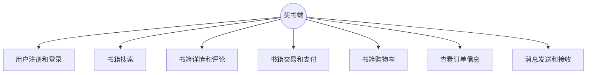
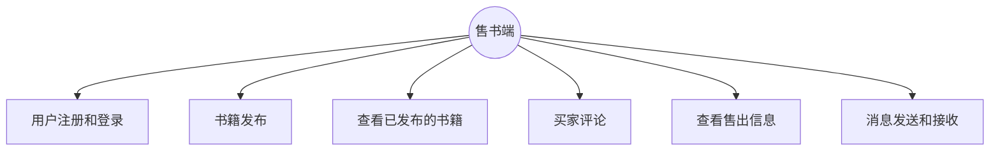
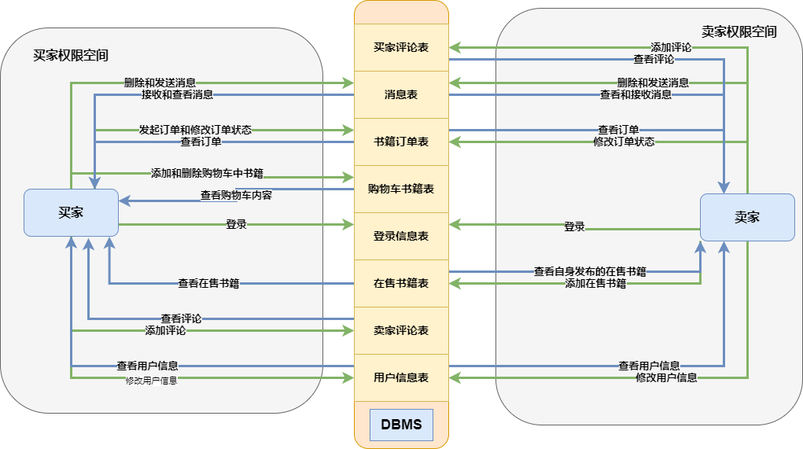

## 1. 需求分析
### 1.1 需求描述
#### 1.1.1 需求梗概
为了解决当前大学很多学生在进入下一级时会有许多不需要的书籍和课本等的问题，我们希望能给学长学姐和学弟学妹们搭建一个二手书传递和购买平台。这个平台的目的是让用户能够方便地出售、捐赠、购买或领取二手书籍，节省资源，促进交流，提高学习效率。为了实现这个目的，我们需要分析用户的需求，设计合适的功能，开发易用的界面，保证安全的交易，提供优质的服务。
#### 1.1.2 详细需求
本次实验实现的书籍传递平台分为买书端、售书端，每个用户既可以是买家，也可以是卖家。对于买书端和售书端的功能设计如下：
##### 买书端
- 用户注册和登录：用户可以注册账号，设置密码和个人信息，登录后可以查看和管理自己的账户。
- 书籍搜索：用户可以根据不同的条件搜索想要购买或领取的二手书籍，如分类、关键词、价格区间等。
- 书籍详情和评论：用户可以查看每本书籍的详细信息，包括卖家的评分和信誉，以及其他用户对该卖家的评论和评价。用户也可以对自己购买过的卖家进行评论和评价，给出星级和反馈。
- 书籍交易和支付：用户可以通过在线或线下的方式与卖家进行沟通和交易，如私信、电话、微信等。如果选择在线支付，用户可以通过平台进行支付。如果选择线下交易，用户可以自行联系卖家，并约定交易地点和时间。
- 书籍购物车：用户可以将自己感兴趣的书籍加入购物车，方便以后查看和购买。
- 查看书籍订单信息，确认和修改订单状态。
- 消息发送和接收：用户可以与卖家进行交易信息的交流。

##### 售书端
- 用户注册和登录：用户可以注册账号，设置密码和个人信息，登录后可以查看和管理自己的账户。
- 书籍发布：用户可以发布自己想要出售或捐赠的二手书籍，填写书籍的名称、作者、出版社、价格、图片、描述等信息，以及联系方式和交易方式。
- 查看已发布的书籍售出信息，并对书籍信息进行修改。
- 买家评论：用户可以对买家进行评分和评论。
- 查看已售出的书籍售出信息。
- 消息发送和接收：用户可以与卖家进行交易信息的交流。

### 1.2 数据流图

### 1.3 数据元素表
#### 用户信息表
| 名称 | 数据类型 | 大小 |是否必填 |是否主键 |功能|
| ------- | ------- | ------- |-------|-------|-------|
| user_id | Varchar | 64 |是|是|用户登录id|
| user_password | Varchar | 64 |是|否|用户登录密码|
|user_name|Varchar|64|是|否|用户昵称|
|user_phonenum|Varchar|11|否|否|用户联系电话|
|user_email|Varchar|64|否|否|用户联系邮箱|
|user_campus|Varchar|32|否|否|用户所在校区|
|user_address|Varchar|64|否|否|用户详细地址|
|user_money|Float|两位小数|是|否|用户余额|
#### 买家评论表
| 名称 | 数据类型 | 大小 |是否必填 |是否主键 |功能|
| ------- | ------- | ------- |-------|-------|-------|
|comment_id|Int|10|是|是|标识评论的id|
|commented_userid|Varchar|64|是|否|被评论买家的id|
|comment_userid|Varchar|64|是|否|评论的卖家id|
|comment_date|Date|\|是|否|评论时间|评论时间|
|comment_content|Varchar|256|是|否|评论内容|
#### 卖家评论表
| 名称 | 数据类型 | 大小 |是否必填 |是否主键 |功能|
| ------- | ------- | ------- |-------|-------|-------|
|comment_id|Int|10|是|是|标识评论的id|
|commented_userid|Varchar|64|是|否|被评论买家的id|
|comment_userid|Varchar|64|是|否|评论的卖家id|
|comment_date|Date|\|是|否|评论时间|评论时间|
|comment_content|Varchar|256|是|否|评论内容|
#### 消息表
| 名称 | 数据类型 | 大小 |是否必填 |是否主键 |功能|
| ------- | ------- | ------- |-------|-------|-------|
|message_id|Varchar|64|是|是|唯一标识消息的id|
|send_id|Varchar|64|是|否|发送者id|
|receive_id|Varchar|64|是|否|接收者id|
|message_content|Varchar|256|是|否|消息内容|
#### 书籍订单表
| 名称 | 数据类型 | 大小 |是否必填 |是否主键 |功能|
| ------- | ------- | ------- |-------|-------|-------|
|order_id|Int|10|是|是|唯一标识订单的id|
|order_time|Date||是|否|购买时间|
|order_book_intro|Varchar|256|是|否|书籍介绍|
|order_book_name|Varchar|256|是|否|书籍名称|
|order_book_price|Float|2位小数|是|否|书籍价格|
|order_customer_id|Varchar|64|是|否|买家id|
|order_merchant_id|Varchar|64|是|否|卖家id|
|order_status|Varchar|10|是|否|订单状态|
|order_customer_name|Varchar|64|是|否|买家昵称|
|order_customer_phonenum|Varchar|11|是|否|买家手机号码|
|order_customer_campus|Varchar|32|是|否|买家所在校区|
|order_customer_address|Varchar|64|是|否|买家详细地址|
|order_merchant_name|Varchar|64|是|否|卖家昵称|
|order_merchant_phonenum|Varchar|11|是|否|卖家手机号码|
|order_merchant_campus|Varchar|32|是|否|卖家所在校区|
|order_merchant_address|Varchar|64|是|否|卖家详细地址|
#### 购物车书籍表
| 名称 | 数据类型 | 大小 |是否必填 |是否主键 |功能|
| ------- | ------- | ------- |-------|-------|-------|
|cart_id|Int|10|是|是|唯一标识购物车项目的id|
|cart_item_id|Int|10|是|否|在售书籍表的表示id|
|cart_user_id|Varchar|64|是|否|购物车所属买家的id|
#### 在售书籍表
| 名称 | 数据类型 | 大小 |是否必填 |是否主键 |功能|
| ------- | ------- | ------- |-------|-------|-------|
|sell_id|Int|10|是|是|唯一标识订单的id|
|sell_merchant_id|Varchar|64|是|否|卖家id|
|sell_merchant_name|Varchar|64|是|否|卖家昵称|
|sell_book_intro|Varchar|256|是|否|书籍介绍|
|sell_book_name|Varchar|256|是|否|书籍名称|
|sell_book_price|Float|2位小数|是|否|书籍价格|
|sell_merchant_phonenum|Varchar|11|是|否|卖家手机号码|
|sell_merchant_campus|Varchar|32|是|否|卖家所在校区|
|sell_merchant_address|Varchar|64|是|否|卖家详细地址|

## 2．数据库概念模式设计

### 2.1 系统初步E-R图

### 2.2 系统基本E-R图

 

## 3. 数据库逻辑模式设计
### 3.1 数据库关系模式
### 3.2 关系模式范式等级的判定与规范化
### 3.3．数据库设计优化